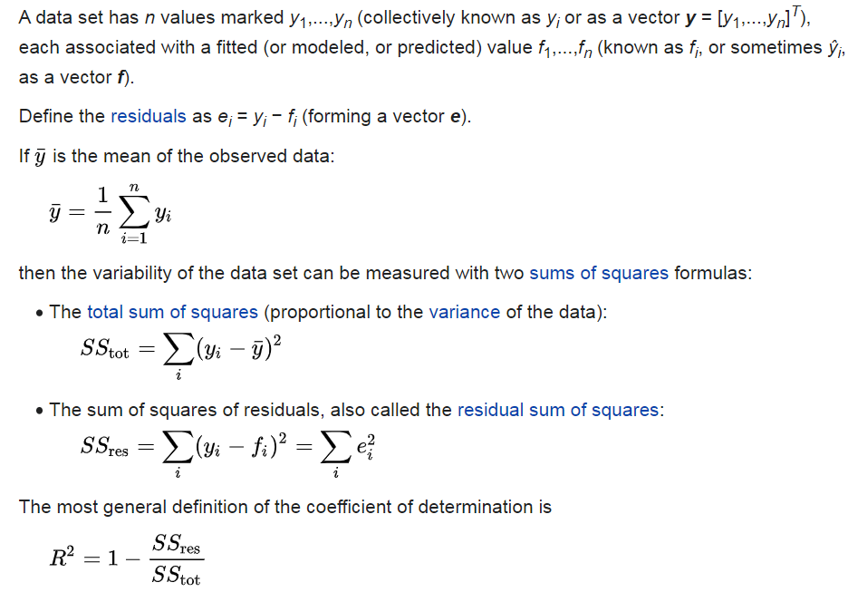
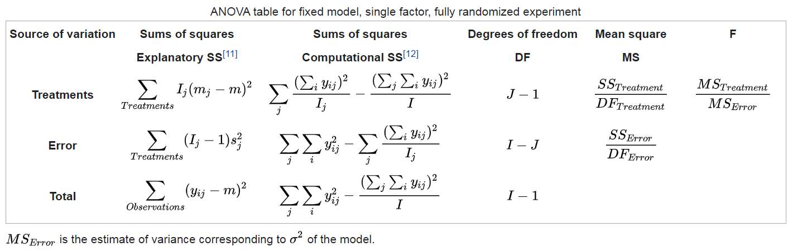
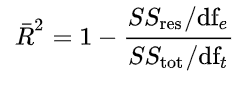

# Prediction from continuous outcome

```{block, type='rmdcomment'}
In this chapter, we will talk about Regression that deals with prediction of continuous outcomes. We will use multiple linear regression to build the first prediction model.
```

- Watch the video describing this chapter [](https://youtu.be/TmrG2ZbeJoY)

```{r setup02, include=FALSE}
require(tableone)
require(Publish)
require(MatchIt)
require(cobalt)
require(ggplot2)
require(caret)
```

## Read previously saved data

```{r}
ObsData <- readRDS(file = "data/rhcAnalytic.RDS")
```

## Prediction for length of stay

```{block, type='rmdcomment'}
In this section, we show the regression fitting when outcome is continuous (length of stay).
```

## Variables

```{r vars2, cache=TRUE, echo = TRUE}
baselinevars <- names(dplyr::select(ObsData, 
                         !c(Length.of.Stay,Death)))
baselinevars
```

## Model

```{r reg2, cache=TRUE, echo = TRUE, results='hide'}
# adjust covariates
out.formula1 <- as.formula(paste("Length.of.Stay~ ", 
                               paste(baselinevars, 
                                     collapse = "+")))
saveRDS(out.formula1, file = "data/form1.RDS")
fit1 <- lm(out.formula1, data = ObsData)
require(Publish)
adj.fit1 <- publish(fit1, digits=1)$regressionTable
```

```{r reg2a, cache=TRUE, echo = TRUE}
out.formula1
adj.fit1
```

### Design Matrix


- Notations
  - n is number of observations 
  - p is number of covariates

Expands factors to a set of dummy variables.

```{r}
dim(ObsData)
length(attr(terms(out.formula1), "term.labels"))
```


```{r}
head(model.matrix(fit1))
dim(model.matrix(fit1))
p <- dim(model.matrix(fit1))[2] # intercept + slopes
p
```


### Obtain prediction

```{r}
obs.y <- ObsData$Length.of.Stay
summary(obs.y)
# Predict the above fit on ObsData data
pred.y1 <- predict(fit1, ObsData)
summary(pred.y1)
n <- length(pred.y1)
n
plot(obs.y,pred.y1)
lines(lowess(obs.y,pred.y1), col = "red")
```

## Measuring prediction error

```{block, type='rmdcomment'}
**Prediction error** measures how well the model can predict the outcome for new data that were **not** used in developing the prediction model.

- Bias reduced for models with more variables
- Unimportant variables lead to noise / variability
- Bias variance trade-off / need penalization
```

### R2

[ref](https://en.wikipedia.org/wiki/Coefficient_of_determination)

```{r ubc8, echo=FALSE, out.width = '90%'}

```

```{r}
# Find SSE
SSE <- sum( (obs.y - pred.y1)^2 )
SSE
# Find SST
mean.obs.y <- mean(obs.y)
SST <- sum( (obs.y - mean.obs.y)^2 )
SST
# Find R2
R.2 <- 1- SSE/SST
R.2
require(caret)
caret::R2(pred.y1, obs.y)
```

### RMSE

[ref](https://en.wikipedia.org/wiki/One-way_analysis_of_variance)

```{r ubc89, echo=FALSE, out.width = '90%'}

```

```{r}
# Find RMSE
Rmse <- sqrt(SSE/(n-p)) 
Rmse
caret::RMSE(pred.y1, obs.y)
```

### Adj R2

[ref](https://en.wikipedia.org/wiki/Coefficient_of_determination#Adjusted_R2)

```{r ubc899, echo=FALSE, out.width = '30%'}

```

```{r}
# Find adj R2
adjR2 <- 1-(1-R.2)*((n-1)/(n-p))
adjR2
```

## Overfitting and Optimism

```{block, type='rmdcomment'}
- Model usually performs very well in the empirical data where the model was fitted in the same data (optimistic)
- Model performs poorly in the new data (generalization is not as good)
```

### Causes

- Model determined by data at hand without expert opinion
- Too many model parameters ($age$, $age^2$, $age^3$) / predictors
- Too small dataset (training) / data too noisy

### Consequences

- Overestimation of effects of predictors
- Reduction in model performance in new observations

### Proposed solutions

We generally use procedures such as 

- Internal validation
  - sample splitting
  - cross-validation
  - bootstrap
- External validation
  - Temporal
  - Geographical
  - Different data source to calculate same variable
  - Different disease
