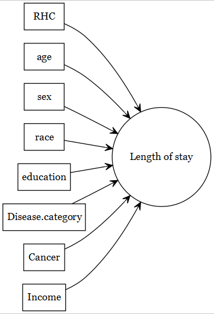
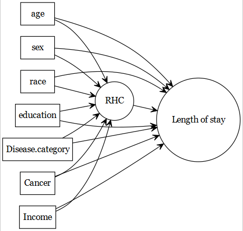

# RHC data description

```{r setup01, include=FALSE}
require(tableone)
require(Publish)
require(MatchIt)
require(cobalt)
```


@connors1996effectiveness published an article in [JAMA](https://jamanetwork.com/journals/jama). The article is about managing or guiding therapy for the critically ill patients in the intensive care unit.  

```{block, type='rmdcomment'}
They considered a number of **health-outcomes** such as 

- *length of stay* (hospital stay; measured continuously)
- *death* within certain period (death at any time up to 180 Days; measured as a binary variable)
```

The original article was concerned about the association of right heart catheterization *(RHC)* use during the first 24 hours of care in the intensive care unit and the health-outcomes mentioned above, but we will use this data as a case study for our **prediction modelling**.


## Data download

```{block, type='rmdcomment'}
Data is freely available from [Vanderbilt Biostatistics](https://hbiostat.org/data/), variable liste is available [here](https://hbiostat.org/data/repo/rhc.html), and the article is freely available from [researchgate](https://www.researchgate.net/profile/Neal-Dawson/publication/236311165_The_Effectiveness_of_Right_Heart_Catheterization_in_the_Initial_Care_of_Critically_III_Patients/links/00b4951fbfa1e051c1000000/The-Effectiveness-of-Right-Heart-Catheterization-in-the-Initial-Care-of-Critically-III-Patients.pdf?_sg%5B0%5D=w-YI1LtI2m34BhMjYD0VGHX5aKtQK5GC0LPU6kGK-_DtVUlZEYOa7_3mMfXk4kxuk0kkbv17Az5L_wNnXBrLnA.cxps1WB76ZpE9eh5Jec453LXKtQ43wuYJ387_IkhN7ZyqQpnMH19d5QsQjdkAz0unUi-vBbjV9HVdx0kvP9K_Q.roLHhvXmlNj_o0ZyC9Ka5c1zj3W4kOJkxuthqWjtSIbB7feq5Am4P47RlHjT0ukvWHAWFaPol2f58a_0v9azaw&_sg%5B1%5D=BjoiK5iqNKf-0ZsH38KwJJ4oUxNRQdVgxfyBeVp_c5Y1WEEspsEwnD1MXeDteXf4y5gsDvAKL-fwqzhoYP1OsiKWDDlX3ccFYn6yASd9oKKq.cxps1WB76ZpE9eh5Jec453LXKtQ43wuYJ387_IkhN7ZyqQpnMH19d5QsQjdkAz0unUi-vBbjV9HVdx0kvP9K_Q.roLHhvXmlNj_o0ZyC9Ka5c1zj3W4kOJkxuthqWjtSIbB7feq5Am4P47RlHjT0ukvWHAWFaPol2f58a_0v9azaw&_iepl=).
```


```{r, cache=TRUE}
# load the dataset
ObsData <- read.csv("https://hbiostat.org/data/repo/rhc.csv", 
                    header = TRUE)
saveRDS(ObsData, file = "data/rhc.RDS")
```

## Creating Analytic data

```{block, type='rmdcomment'}
In this section, we show the process of preparing analytic data, so that the variables generally match with the way they were coded in the original article.
```

Below we show the process of creating the analytic data.

### Add column for outcome: length of stay

```{r}
# Length.of.Stay = date of discharge - study admission date
# Length.of.Stay = date of death - study admission date 
# if date of discharge not available
ObsData$Length.of.Stay <- ObsData$dschdte - 
  ObsData$sadmdte
ObsData$Length.of.Stay[is.na(ObsData$Length.of.Stay)] <- 
  ObsData$dthdte[is.na(ObsData$Length.of.Stay)] - 
  ObsData$sadmdte[is.na(ObsData$Length.of.Stay)]
```

### Recoding column for outcome: death

```{r}
ObsData$death <- ifelse(ObsData$death == "Yes", 1, 0)
```


### Remove unnecessary outcomes

```{r}
ObsData <- dplyr::select(ObsData, 
                         !c(dthdte, lstctdte, dschdte, 
                            t3d30, dth30, surv2md1))
```

### Remove unnecessary and problematic variables 
```{r}
ObsData <- dplyr::select(ObsData, 
                         !c(sadmdte, ptid, X, adld3p, 
                            urin1, cat2))
```

### Basic data cleanup 

```{r}
# convert all categorical variables to factors
factors <- c("cat1", "ca", "death", "cardiohx", "chfhx", 
             "dementhx", "psychhx", "chrpulhx", "renalhx", 
             "liverhx", "gibledhx", "malighx", "immunhx", 
             "transhx", "amihx", "sex", "dnr1", "ninsclas", 
             "resp", "card", "neuro", "gastr", "renal", "meta", 
             "hema", "seps", "trauma", "ortho", "race", 
             "income")
ObsData[factors] <- lapply(ObsData[factors], as.factor)
# convert RHC.use (RHC vs. No RHC) to a binary variable
ObsData$RHC.use <- ifelse(ObsData$swang1 == "RHC", 1, 0)
ObsData <- dplyr::select(ObsData, !swang1)
# Categorize the variables to match with the original paper
ObsData$age <- cut(ObsData$age,
                   breaks=c(-Inf, 50, 60, 70, 80, Inf),
                   right=FALSE)
ObsData$race <- factor(ObsData$race, 
                       levels=c("white","black","other"))
ObsData$sex <- as.factor(ObsData$sex)
ObsData$sex <- relevel(ObsData$sex, ref = "Male")
ObsData$cat1 <- as.factor(ObsData$cat1)
levels(ObsData$cat1) <- c("ARF","CHF","Other","Other","Other",
                          "Other","Other","MOSF","MOSF")
ObsData$ca <- as.factor(ObsData$ca)
levels(ObsData$ca) <- c("Metastatic","None","Localized (Yes)")
ObsData$ca <- factor(ObsData$ca, levels=c("None",
                                          "Localized (Yes)",
                                          "Metastatic"))
```

### Rename variables

```{r}
names(ObsData) <- c("Disease.category", "Cancer", "Death", "Cardiovascular", 
                    "Congestive.HF", "Dementia", "Psychiatric", "Pulmonary", 
                    "Renal", "Hepatic", "GI.Bleed", "Tumor", 
                    "Immunosupperssion", "Transfer.hx", "MI", "age", "sex", 
                    "edu", "DASIndex", "APACHE.score", "Glasgow.Coma.Score", 
                    "blood.pressure", "WBC", "Heart.rate", "Respiratory.rate", 
                    "Temperature", "PaO2vs.FIO2", "Albumin", "Hematocrit", 
                    "Bilirubin", "Creatinine", "Sodium", "Potassium", "PaCo2", 
                    "PH", "Weight", "DNR.status", "Medical.insurance", 
                    "Respiratory.Diag", "Cardiovascular.Diag", 
                    "Neurological.Diag", "Gastrointestinal.Diag", "Renal.Diag",
                    "Metabolic.Diag", "Hematologic.Diag", "Sepsis.Diag", 
                    "Trauma.Diag", "Orthopedic.Diag", "race", "income", 
                    "Length.of.Stay", "RHC.use")
saveRDS(ObsData, file = "data/rhcAnalytic.RDS")
```

## Notations

|Notations| Example in RHC study|
|---|---|
|$Y_1$: Observed outcome  | length of stay  |  
|$Y_2$: Observed outcome  | death within 3 months  |  
|$L$: Covariates  | See below |  

## Basic data exploration

### Dimension and summary

```{r}
dim(ObsData)
#str(ObsData)
```

### More comprehensive summary

```{r}
require(skimr)
skim(ObsData)
#require(rms)
#describe(ObsData) 
```

## Predictive vs. causal models

The focus of current document is predictive models (e.g., predicting a health outcome). 

```{r plot27777, echo=FALSE}

```

The original article by @connors1996effectiveness focused on the association of 

- right heart catheterization *(RHC)* use during the first 24 hours of care in the intensive care unit (exposure of primary interest) and 
- the health-outcomes (such as length of stay).

```{r plot27777g, echo=FALSE}

```

```{block, type='rmdcomment'}
- If the readers are interested about the **causal models** used in that article, they can refer to [this tutorial](https://ehsanx.github.io/psw/). 
- This data has been used in other articles in the literature within the **advanced causal modelling** context; for example @keele2021comparing and @keele2018pre. Readers can further consult  [this tutorial](https://ehsanx.github.io/TMLEworkshop/) to understand those methods.
```
