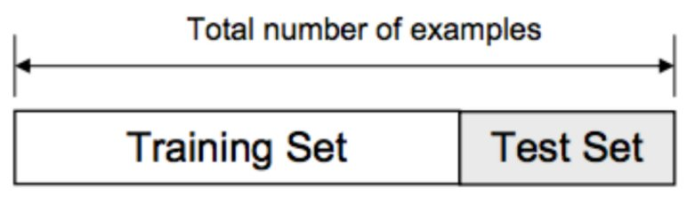

# Data spliting

## Read previously saved data

```{r}
ObsData <- readRDS(file = "data/rhcAnalytic.RDS")
```

[ref](https://www.kdnuggets.com/2020/05/dataset-splitting-best-practices-python.html)

```{r c674, echo=FALSE, out.width = '90%'}

```

[ref](https://topepo.github.io/caret/data-splitting.html)

```{r}
# Using a seed to randomize in a reproducible way 
set.seed(123)
require(caret)
split<-createDataPartition(y = ObsData$Length.of.Stay, 
                           p = 0.7, list = FALSE)
str(split)
dim(split)
dim(ObsData)*.7 # approximate train data
dim(ObsData)*(1-.7) # approximate train data
```

## Split the data 
```{r}
# create train data
train.data<-ObsData[split,]
dim(train.data)
# create test data
test.data<-ObsData[-split,]
dim(test.data)
```

## Train the model
```{r}
out.formula1 <- readRDS(file = "data/form1.RDS")
out.formula1
fit.train1<-lm(out.formula1, data = train.data)
# summary(fit.train1)
```

### Function that gives performance measures
```{r}
perform <- function(new.data,
                    model.fit,model.formula=NULL, 
                    y.name = "Y",
                    digits=3){
  # data dimension
  p <- dim(model.matrix(model.fit))[2]
  # predicted value
  pred.y <- predict(model.fit, new.data)
  # sample size
  n <- length(pred.y)
  # outcome
  new.data.y <- as.numeric(new.data[,y.name])
  # R2
  R2 <- caret:::R2(pred.y, new.data.y)
  # adj R2 using alternate formula
  df.residual <- n-p
  adjR2 <- 1-(1-R2)*((n-1)/df.residual)
  # RMSE
  RMSE <-  caret:::RMSE(pred.y, new.data.y)
  # combine all of the results
  res <- round(cbind(n,p,R2,adjR2,RMSE),digits)
  # returning object
  return(res)
}
```

## Extract performance measures
```{r}
perform(new.data=train.data,
        y.name = "Length.of.Stay",
        model.fit=fit.train1)
perform(new.data=test.data,
        y.name = "Length.of.Stay",
        model.fit=fit.train1)
perform(new.data=ObsData,
        y.name = "Length.of.Stay",
        model.fit=fit.train1)

```


